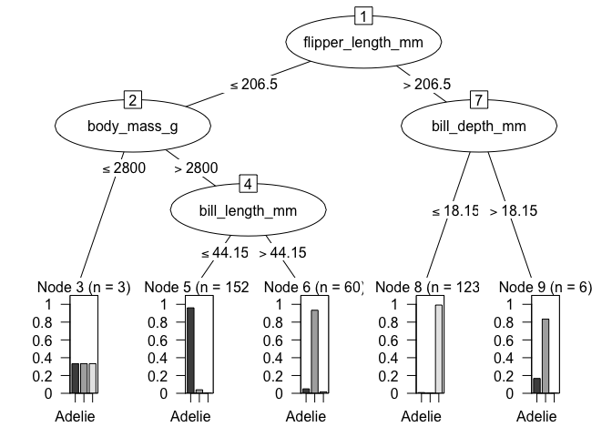

<!-- README.md is generated from README.Rmd. Please edit that file -->

# lorax

<!-- badges: start -->

[](https://github.com/topepo/lorax/actions/workflows/R-CMD-check.yaml)
[](https://app.codecov.io/gh/topepo/lorax)
<!-- badges: end -->

The goal of lorax is to help look at different aspects of tree- and
rule-based models.

lorax supports a few APIs:

- `as.party()` converts trees to the format used by `partykit::ctree()`,
  mostly because it has an amazing `plot()` method.
- `extract_rules()` helps write out the logical paths to the terminal
  nodes.
- `active_predictors()` enumerates which predictors were actually used
  in a split.
- `var_imp()` is a wrapper for any importance method contained in the
  package. This is a wrapper that enables a common interface to the
  scores.

Here is a list of which classes have which methods:

| class         | var_imp | active_predictors | as.party | extract_rules |
|:--------------|:--------|:------------------|:---------|:--------------|
| bart          | n/a     | ✔                 | ✔        | ✔             |
| C5.0          | n/a     | ✔                 | ✔        | ✔             |
| cforest       | ✔       | ✔                 | n/a      | ✔             |
| grf           | ✔       | ✔                 | ✔        | ✔             |
| lgb.Booster   | ✔       | ✔                 | ✔        | ✔             |
| ObliqueForest | ✔       | ✔                 | ✖        | ✔             |
| party         | ✔       | ✔                 | n/a      | ✔             |
| randomForest  | ✔       | ✔                 | ✔        | ✔             |
| ranger        | ✔       | ✔                 | ✔        | ✔             |
| rpart         | ✔       | ✔                 | n/a      | ✔             |
| xgb.Booster   | ✔       | ✔                 | ✔        | ✔             |

Note that `as.party.rpart()` is in the partykit package and that cforest
is made out of party objects.

## Installation

You can install the development version of lorax like so:

``` r
require(pak)
pak::pak("topepo/lorax)
```

## Example

``` r
set.seed(822)
rngr_fit <- ranger(species ~ ., data = penguins, max.depth = 3, num.trees = 10)
```

``` r
rngr_party <- as.party(rngr_fit, data = penguins, tree = 1)
rngr_party
#> 
#> Model formula:
#> ~island + bill_length_mm + bill_depth_mm + flipper_length_mm + 
#>     body_mass_g + sex + year
#> 
#> Fitted party:
#> [1] root
#> |   [2] flipper_length_mm <= 206.5
#> |   |   [3] body_mass_g <= 2800: Adelie (n = 3, err = 66.7%)
#> |   |   [4] body_mass_g > 2800
#> |   |   |   [5] bill_length_mm <= 44.15: Adelie (n = 152, err = 3.9%)
#> |   |   |   [6] bill_length_mm > 44.15: Chinstrap (n = 60, err = 6.7%)
#> |   [7] flipper_length_mm > 206.5
#> |   |   [8] bill_depth_mm <= 18.15: Gentoo (n = 123, err = 0.8%)
#> |   |   [9] bill_depth_mm > 18.15: Chinstrap (n = 6, err = 16.7%)
#> 
#> Number of inner nodes:    4
#> Number of terminal nodes: 5

plot(rngr_party)
```



``` r
all_rules <- extract_rules(rngr_party, trees = 10)

# An expression
all_rules$rules[[1]]
#> flipper_length_mm <= 206.5 & body_mass_g <= 2800

# Text
all_rules$rules[[1]] |> rule_text()
#> [1] "flipper_length_mm <= 206.5 & body_mass_g <= 2800"

# Substitutions
new_names <- 
 tribble(
  ~ original, ~ label,
  "flipper_length_mm", "Flipper Length",
  "body_mass_g", "Body Mass"
 )
 
all_rules$rules[[1]] |> rule_text(key = new_names)
#> [1] "Flipper Length <= 206.5 & Body Mass <= 2800"

# Bullets:
all_rules$rules[[1]] |> 
 rule_text(key = new_names, bullets = TRUE) |> 
 cat()
#> * Flipper Length <= 206.5
#> * Body Mass <= 2800
```

## Code of Conduct

Please note that the lorax project is released with a [Contributor Code
of
Conduct](https://contributor-covenant.org/version/2/1/CODE_OF_CONDUCT.html).
By contributing to this project, you agree to abide by its terms.
